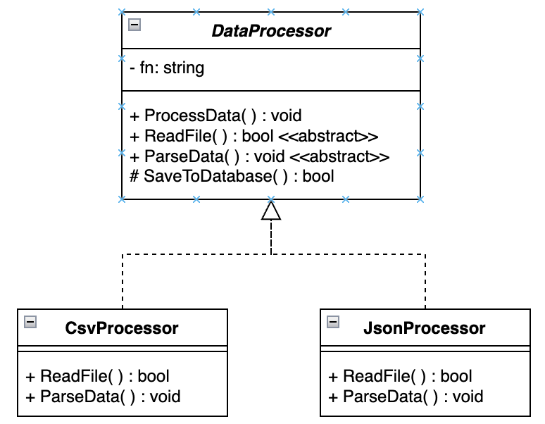

### Definition
collapsed:: true
	- The **Template Method** pattern defines the **skeleton of an algorithm** in a base (abstract) class, allowing subclasses to **customize certain steps** without changing the algorithm’s structure.
	- This pattern separates **invariant steps** (the structure) from **variant steps** (the details).
	-
	- Adapted from **Design Patterns** (GoF Book):
	  “*Defines the skeleton of an algorithm in an operation, deferring some steps to subclasses. Template Method lets subclasses redefine certain steps of an algorithm without changing the algorithm’s structure.*”
	  ---
- ### Key Idea
  collapsed:: true
	- The **base class** defines *what happens* and *in what order*.
	- **Subclasses** define *how each step* happens.
	- Promotes **code reuse** and **consistent behavior** across variations.
	  
	  ---
- ### Contrast: Without Template Method
  collapsed:: true
	- In a **hardcoded** approach:
		- Each class reimplements the same workflow.
		- Changes require modifying multiple places.
		- Code duplication increases maintenance cost.
	- The Template Method pattern fixes this by centralizing the workflow and delegating step-specific behavior to subclasses.
	  
	  ---
- ### Example 1: Without Template Method
  collapsed:: true
	- ```
	  using System;
	  
	  public class CsvProcessor
	  {
	    public void ProcessData()
	    {
	        Console.WriteLine("Reading CSV file...");
	        Console.WriteLine("Parsing CSV data...");
	        Console.WriteLine("Saving results to database...");
	    }
	  }
	  
	  public class JsonProcessor
	  {
	    public void ProcessData()
	    {
	        Console.WriteLine("Reading JSON file...");
	        Console.WriteLine("Parsing JSON data...");
	        Console.WriteLine("Saving results to database...");
	    }
	  }
	  
	  public class Program
	  {
	    public static void Main()
	    {
	        var csv = new CsvProcessor();
	        csv.ProcessData();
	  
	        var json = new JsonProcessor();
	        json.ProcessData();
	    }
	  }
	  ```
	- #### Problems:
	- Each processor repeats the same structure (read → parse → save).
	- Any change to the workflow (e.g., add validation) must be made in *every class*.
	- Low maintainability and poor reuse.
	  
	  ---
- ### Example 2: Using the Template Method Pattern
  collapsed:: true
	- ```
	  using System;
	  
	  public abstract class DataProcessor
	  {
	    // Template Method: defines the algorithm structure
	    public void ProcessData()
	    {
	        ReadFile();
	        ParseData();
	        SaveToDatabase();
	    }
	  
	    protected abstract void ReadFile();
	    protected abstract void ParseData();
	  
	    // Common step shared across all processors
	    protected virtual void SaveToDatabase()
	    {
	        Console.WriteLine("Saving results to database...");
	    }
	  }
	  
	  public class CsvProcessor : DataProcessor
	  {
	    protected override void ReadFile() => Console.WriteLine("Reading CSV file...");
	    protected override void ParseData() => Console.WriteLine("Parsing CSV data...");
	  }
	  
	  public class JsonProcessor : DataProcessor
	  {
	    protected override void ReadFile() => Console.WriteLine("Reading JSON file...");
	    protected override void ParseData() => Console.WriteLine("Parsing JSON data...");
	  }
	  
	  public class Program
	  {
	    public static void Main()
	    {
	        DataProcessor csv = new CsvProcessor();
	        csv.ProcessData();
	  
	        DataProcessor json = new JsonProcessor();
	        json.ProcessData();
	    }
	  }
	  ```
	- #### Benefits:
	- The **workflow** (read → parse → save) is defined **once** in the base class.
	- Each subclass customizes **only** what’s different.
	- Adding new file types (e.g., XML) requires **no changes** to existing classes.
	  
	  ---
- ### UML Diagram
  collapsed:: true
	-  
	  
	  ---
- ### Top 3  *-ilities*  Promoted
  collapsed:: true
	- **Reusability**
		- Common logic lives in the base class and is reused by all subclasses.
	- **Maintainability**
		- Changing the workflow happens in one place—the base class.
	- **Extensibility**
		- New subclasses can define new behaviors without modifying existing code.
		  
		  ---
- ### Summary
  collapsed:: true
	- The **Template Method pattern** is ideal when:
		- Multiple classes share the same workflow structure but differ in details.
		- You want to **enforce a consistent process** across implementations.
	- Encourages a clean separation between **what varies** and **what stays the same**, improving design quality.
	  
	  ---
- ### Discussion
  collapsed:: true
  
  ---
	- #### 1.  What would happen if the base class’s  `TemplateMethod()`  were made  `virtual`  instead of  `non-virtual` ?
	  collapsed:: true
		- **Answer:**
			- Subclasses could override the entire algorithm, defeating the purpose of the pattern.
			- So, the template method must remain **non-virtual** to preserve the algorithm structure and enforce consistency.
			  
			  ---
	- #### 2. When might using the Template Method pattern be  **overkill** ?
	  collapsed:: true
		- **Answer:**
			- When there’s **only one** concrete implementation or the algorithm is **unlikely to vary**.
			- In such cases, an abstract class hierarchy adds unnecessary complexity.
			  
			  ---
	- #### 3. How is this pattern related to the  **Open/Closed Principle (OCP)** ?
	  collapsed:: true
		- **Answer:**
			- It supports OCP by allowing new subclasses (new behaviors) to be **added without modifying existing code**.
			- The algorithm structure is closed to modification but open to extension.
			  
			  ---
	- #### 4. Could we use  **interfaces**  instead of an abstract base class here?
	  collapsed:: true
		- **Answer:**
			- Not effectively.
			- Interfaces can define *what* methods exist but not the **order or structure** of the algorithm.
			- The Template Method pattern requires a **concrete flow**, which an abstract class provides.
			  
			  ---
	- #### 5. How does this pattern compare to the  **Strategy pattern** ?
	  collapsed:: true
		- **Answer:**
			- **Template Method:** defines the algorithm structure in one place and lets subclasses fill in steps.
			- **Strategy:** delegates the entire algorithm to interchangeable objects.
			- In short, Template Method = **inheritance-based**, Strategy = **composition-based**.
			  
			  ---